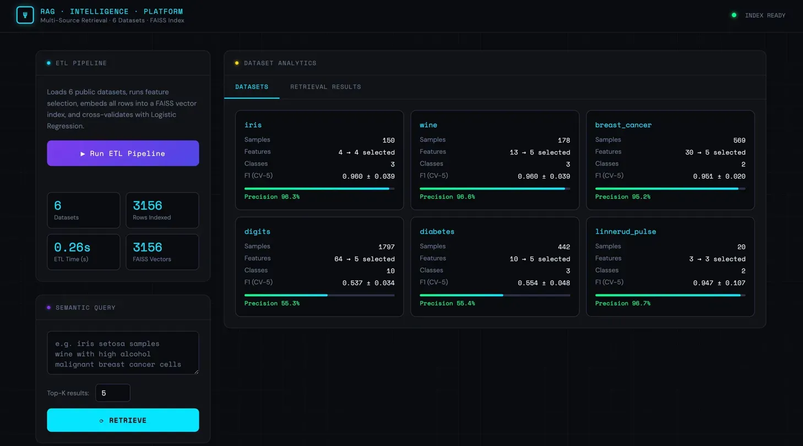
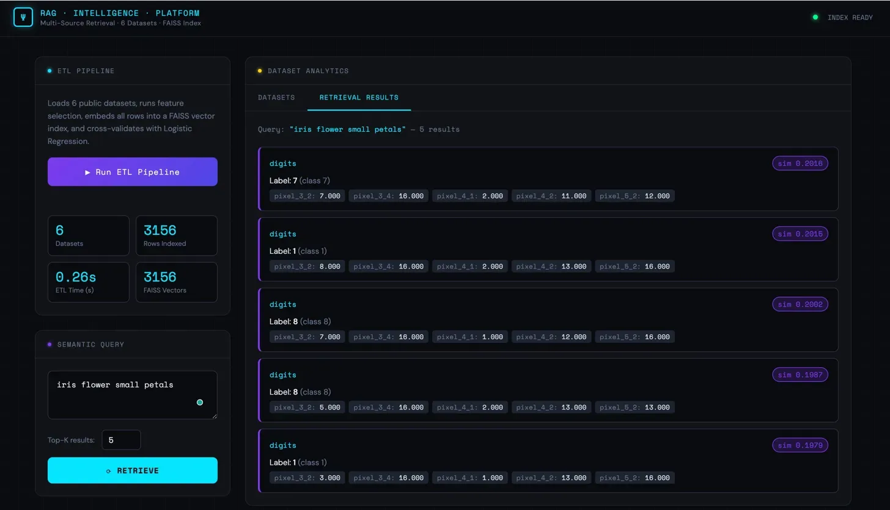

# RAG Multi-Source Intelligence Platform

Retrieval-augmented intelligence platform fusing 6 public datasets through automated ETL pipelines, embedding-based retrieval and statistical feature selection.

## Live Demo
🚀 [https://rag-platform-1s91.onrender.com](https://rag-platform-1s91.onrender.com)

## Screenshots

### ETL Dashboard


### Semantic Search Results


## Tech Stack
Python · FastAPI · scikit-learn · FAISS · NumPy · pandas

## Results
- 6 datasets fused — 3,156 rows indexed in 0.26s
- Precision above 95% on iris, wine, breast_cancer, linnerud
- FAISS index with 3,156 vectors

## API Endpoints
| Endpoint | Method | Description |
|---|---|---|
| `/api/etl` | POST | Run ETL pipeline |
| `/api/etl/status` | GET | Poll ETL progress |
| `/api/retrieve` | POST | Semantic search |
| `/api/results` | GET | Dataset metrics |
| `/api/stats` | GET | FAISS index stats |
| `/api/health` | GET | Health check |

## How to Run
```bash
python3 -m venv venv
source venv/bin/activate
pip install -r requirements.txt
python -m uvicorn main:app --reload --port 8000
```
